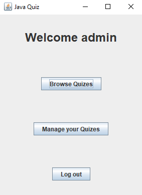
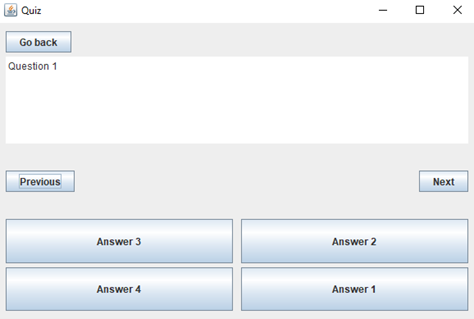
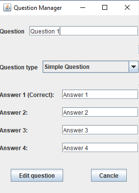
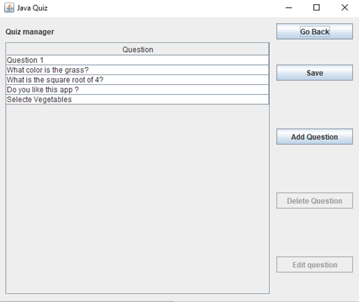
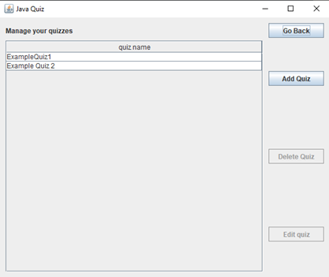

# JAVA QUIZZY
## What is it all about?
This is a project to pass my academic course. It is an app created for use in local networks where users can create, share and solve quizzes. This app was made using Java language and also a Swing and JDBC library.

## Features
- Sing up and Sing in option
- Creating quizzes
- Multiple types of questions(ex. True or False, Multiple Selection)
- Storing all data in a database
- Viewing and solving questions that are in the same network as a database.

## Some screens of the app
### Login menu
\
### Main menu (After successful sing in)
\
### Example Questions
\
\
### Editor for specific question
\
### Manager for questions in your Quizz
\
### Quizz Browser

